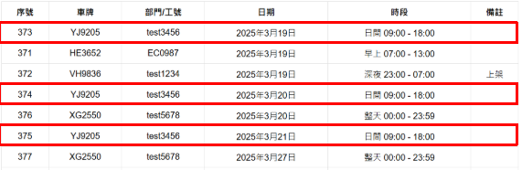

用户指南

- [**基本介紹**](#基本介紹)
- [**申請預約**](#申請預約)
1. [**指明日期及時段的預約**](#指明日子及時段的預約)
1. [**相同車輛、相同時段的連續多天預約**](#相同車輛、相同時段的連續多天預約)
1. [**相同車輛、相同時段的連續多星期預約**](#相同車輛、相同時段的連續多星期預約)
- [**取消預約**](#取消預約)
- [**預約狀態**](#預約狀態)
1. [**預約狀態數據**](#預約狀態數據)
1. [**數據排序說明**](#數據排序說明)
1. [**篩選數據**](#篩選數據)
   1. [**篩選日期**](#篩選日期)
   1. [**篩選車牌**](#篩選車牌)
   1. [**篩選部門/工號**](#篩選篩選部門工號)

**基本介紹**

在申請預約、取消預約、預約狀態* 分頁中，頁面左上角有符號▷，

按下▷可展開設定頁，按◁可隱藏設定頁。

|**申請預約**|**取消預約**|**預約狀態**|
| :-: | :-: | :-: |
|||![ref1]|

**申請預約**

I.	指明日子及時段的預約

例子：VH9836 (尾板車) / 2025年3月19日 / 深夜 23:00 - 07:00 /上架

必須輸入的選項有"部門"、"員工編號"、"車牌"、"開始日期"、"時段"、"備註"。

預約記錄結果

II.	相同車輛、相同時段的連續多天預約

例子：YJ9205 (電動VAN) / 2025年3月19日 - 21日 / 日間 09:00 - 18:00

必須輸入的選項有"部門"、"員工編號"、"車牌"、"開始日期"、"結束日期"、"時段"。

預約記錄結果

III.	相同車輛、相同時段的連續多星期預約

例子：XG2550 (私家車) / 2025年3月19日 - 28日/ 逢星期四 / 整天 00:00 - 23:59

必須輸入的選項有"部門"、"員工編號"、"車牌"、"開始日期"、"結束日期"、"每個星期"、"時段"。

預約記錄結果

**取消預約**

例子 : 取消序號#374的預約

必須輸入的選項有"序號"、"部門"、"員工編號"、"車牌"、"清楚及明白"。

預約記錄結果

**預約狀態**

I.	預約狀態數據

- 預約狀態頁面每120秒重新讀取數據
  - 在設定頁中按下"重刷頁面"按鈕，即可重新讀取數據

II.	數據排序說明

|**顯示位置**|**日期 (初級排序)**|**時段 (次級排序)**|
| :-: | :-: | :-: |
|頂端|最近日期|日間 09:00 - 18:00|
|⬇|⬇|早上 07:00 - 13:00|
|⬇|⬇|中午 12:00 - 14:00|
|⬇|⬇|下午 13:00 - 18:00|
|⬇|⬇|傍晚 18:00 - 23:00|
|⬇|⬇|深夜 23:00 - 07:00|
|⬇|⬇|通宵 18:00 - 07:00|
|底端|最遠日期|整天 00:00 - 23:59|

顯示例子結果

III.	篩選數據

在設定頁中，從清單選擇所需資料，再按確定。

![ref2]

例子：篩選日期

預約記錄結果

例子：篩選車牌

預約記錄結果

例子：篩選部門/工號

預約記錄結果

[ref1]: Aspose.Words.8cbcf164-09e0-4412-9a83-3d6ddd2ca82f.003.png
[ref2]: Aspose.Words.8cbcf164-09e0-4412-9a83-3d6ddd2ca82f.015.png
